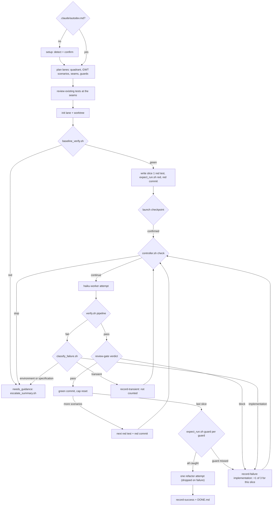

# AutoDev

Bounded test-driven development loop for Claude Code: take a plan or ticket(s)
and work it to done, blocked, or needs-guidance — red tests first, one slice at
a time — without letting the model grind indefinitely or grade its own
homework.

## Install

```
/plugin install autodev@nautilai
```

## Usage

```
/autodev <plan or ticket(s) | path or URL>        # full run
/autodev --setup                                  # write the TDD profile
/autodev --plan-only <plan or ticket(s)>          # stop at the launch checkpoint
/autodev --review-tests <path>                    # FIRST-U review of existing tests
/autodev --unattended <plan or ticket(s)>         # advisor answers the checkpoint
```

The first run in a repo writes a **TDD profile** at `.claude/autodev.md`: the
single-file test command, full suite, lint and format commands, coverage, test
DB isolation, frozen test config, and stack. Setup detects each value, shows its
source file, and asks you to confirm. Commit the file.

## How it works



- **TDD rules** live in `skills/autodev/references/tdd.md`: FIRST-U, the
  complexity quadrant and First-U choice, Given/When/Then, the loop, guard
  checks, coverage, test anti-patterns, and stack patterns (pytest, Factory
  Boy, Vitest, React Testing Library). Each lane gets a frozen, role-scoped cut:
  `TDD-worker.md` for the worker and `TDD-review.md` for the review gate, with
  only the stacks the profile lists.
- **Launch checkpoint** — one stop before any attempt: seams, scenarios in slice
  order, quadrant placement and First-U choice, guards, exemptions, proposed
  test-fix lanes, and the first red test with its real failure output.
- **Red tests, one slice at a time** — the orchestrator writes each red test,
  `expect_run.sh red` proves it fails for a real reason (not a timeout, missing
  command, or empty collection), and it is committed before the worker starts.
  The worker cannot change it: `verify.sh` fails the attempt if any red test or
  profile `test_config` file differs from the red commit, or if a test file
  that existed before the lane changed without TASK.md authorizing it.
- **One task lane per independent task** — state in `.autodev/<slug>/`
  (`TASK.md`, `RUNSTATE.md`, `DONE.md`, TDD files, optional `VERIFY.sh`), all
  self-gitignored.
- **Scripted worktrees** — every lane gets `.autodev-worktrees/<slug>` on an
  `autodev/<slug>` branch via `create_worktree.sh`, with its `base_sha`
  recorded once.
- **Verification pipeline** — frozen-test check, red tests, lint and format
  check on changed files, lane `VERIFY.sh`, then the full suite (profile
  `full_suite`, else repo `VERIFY.sh`, else auto-detected npm/pytest/go/cargo).
  Coverage is reported, never gated. Lanes without a profile keep the old
  single-verifier behavior.
- **Review gate** — after `verify.sh` passes, an independent `review-gate`
  agent reviews the diff against TASK.md and the lane's `TDD-review.md`.
  Blocking findings count as an implementation failure.
- **Guard check** — for every guard the spec demands, `expect_run.sh guard`
  removes it in a throwaway worktree and requires its test to go red.
- **Commits** — red, green, and refactor commits on the lane branch, through
  `commit_lane.sh`. Hooks always run; never `--no-verify`.
- **Failure accounting** — failures are classified and fingerprinted; only
  implementation failures count, 3 per slice. A repeated identical failure
  stops the lane at once.
- **Unattended runs** — with `--unattended`, the `advisor` agent (staff-engineer
  role, fresh context) answers the launch checkpoint and spec gaps (setup
  stays a user stop), each decision logged for your
  validation at the end. It never decides changes outside the lane branch,
  secret-scanner hits, or anything irreversible.
- **Bounded parallelism** — up to 5 lanes at once, only when marked
  `parallel_safe` by a conservative heuristic.

## Scripts

All invoked by the skill via `${CLAUDE_PLUGIN_ROOT}/scripts/`:

| Script | Purpose |
| --- | --- |
| `init_task_lane.sh <slug> "<task>"` | Create lane files, freeze TDD files + profile |
| `create_worktree.sh <slug> [base]` | Create/reuse the lane worktree, record `base_sha` |
| `remove_worktree.sh <slug>` | Remove worktree + `autodev/<slug>` branch |
| `baseline_verify.sh <worktree> <slug>` | Pre-flight green check |
| `verify.sh [dir] [lane-dir]` | Verification pipeline (TDD lanes) or single verifier |
| `expect_run.sh red\|green\|guard …` | Red check, refactor check, guard mutation check |
| `commit_lane.sh <wt> <lane> <kind> "<subject>" <file>…` | Allowlisted Conventional Commit on the lane branch |
| `drop_slice.sh <wt> <lane> "<reason>"` | Drop a slice after an unattended spec gap |
| `drop_slice.sh --checkpoint <lane> "<reason>"` | Log a scenario dropped at the launch checkpoint |
| `profile.py get\|cut …` | Read the TDD profile; cut TDD rules per role |
| `classify_failure.sh <log>` | Bucket a failure log |
| `fingerprint_failure.sh <log>` | Digit/hex-stripped failure hash |
| `controller.sh <cmd> …` | State machine over `.autodev/state.json` |
| `parallel_safe.sh <task-file>` | Conservative parallelism heuristic |
| `escalate_summary.sh <lane-dir>` | Guidance handoff for a blocked lane |
| `list_lanes.sh` | List lane directories |

## AutoDev vs `/goal`

Claude Code's built-in `/goal` (v2.1.139+) also drives work to a completion
condition, and for a quick "keep going until the tests pass" in a session
you're watching, it's the right lighter tool. AutoDev exists for the
unattended case, where the differences are structural:

| | `/goal` | AutoDev |
| --- | --- | --- |
| Completion decided by | an evaluator model **reading the transcript** — it can't run commands, so it grades what the model *reports* | `verify.sh` exit code, run by scripts, with logs and a `DONE.md` proof |
| Failure handling | turn/time cap, then stops — no classification, no repeat detection, no handoff | classify → fingerprint → counted 3-cap → escalation summary |
| Blast radius | your live checkout | isolated worktree per lane |
| Concurrency | one goal per session | up to 5 gated lanes |
| Attempt cost | full-context main-loop turns | disposable haiku workers |

And where `/goal` provides no quality controls beyond your condition text,
AutoDev runs an independent review gate after tests pass — something `/goal`
structurally can't do, since its evaluator cannot execute a reviewer.

## Conventions

`review-gate` is a deliberate exception to the repo-wide
[finding-dispositions](../docs/conventions/finding-dispositions.md) convention:
it returns a `pass`/`block` verdict with blocking/advisory findings instead of
`auto-fix`/`report`/`ask-user`. It's a pipeline-internal gate consumed by the
orchestrator, not a user-facing review — `block` maps to `ask-user` (the
orchestrator decides whether to loop or escalate), `advisory` maps to
`report`, and there is no `auto-fix` because the reviewer is read-only
(`Read, Bash, Grep, Glob`, no `Edit`/`Write`).

In `--unattended` runs, the `advisor` decides `ask-user` items (seams, red tests, test-fix lanes, in-lane hook fixes, spec gaps) and logs each
decision; the user validates the log at the end. Changes outside the lane
branch, secret-scanner hits, and anything irreversible stay strict `ask-user`.
`--review-tests` follows the convention as written: no `auto-fix`, scores and
advisory findings are `report`, blocking-class findings are `ask-user`.

## Design notes

- No hooks. An earlier iteration ran the verifier as a `Stop` hook in every
  repo the plugin was enabled in; that was invasive (full test suite on every
  stop, and a blocking error in repos with no test suite) and was removed.
  Verification runs only inside the `/autodev` loop.
- The worker never creates `DONE.md`; the orchestrator writes it only after
  `verify.sh` passes.
- `VERIFY.sh` receives `AUTODEV_PHASE` (`baseline` | `attempt`) so greenfield
  tasks — where the deliverable doesn't exist yet — can pass baseline honestly
  without falsely passing completion.
- Classification heuristics are deliberately narrow: a misclassified
  implementation failure would be an *uncounted* retry, so ambiguous logs
  default to `implementation`.

## Tests

Self-contained, offline bash suites (fixtures in `mktemp` dirs, a fake `HOME`
for plugin detection):

```bash
bash autodev/tests/scripts.test.sh
bash autodev/tests/tdd.test.sh
```

The planning behavior has a live eval (real `claude -p` calls, not in CI):
`bash autodev/tests/eval/live-validate.sh` — see
[`tests/eval/LIVE-LEDGER.md`](tests/eval/LIVE-LEDGER.md).

Fittingly, the suite was authored by the plugin itself during its first live
validation run.

## Validated scope

Five live validation runs across five repos (see
[`tests/SCENARIOS.md`](tests/SCENARIOS.md)) — but scope is narrower than
"any repo", deliberately stated:

- **Stacks validated:** npm (`node --test`), bun-via-npm, pytest — all with
  fast suites (≤30s). go/cargo detection exists but is unexercised. pnpm/yarn
  workspaces and SwiftPM need a hand-written lane `VERIFY.sh`.
- **Environment:** one macOS machine, with user-level guardrail hooks (the
  secrets protection observed in run #5 came from the environment, not this
  plugin). Linux/CI untested.
- **Orchestration path validated:** teammate-fallback only; every run
  hand-substituted `${CLAUDE_PLUGIN_ROOT}`. The native installed-plugin path
  (skill triggering, agent-type resolution, main-session signals) has not run.
- **TDD flow:** scripts are covered offline (`tdd.test.sh`); the end-to-end
  red → checkpoint → slices → guard → refactor flow has not run live.
- **Review gate:** 3-for-3 correct blocks live; zero live `pass` verdicts —
  the DONE.md happy path through the gate and the false-positive rate are
  unmeasured.

## Backlog

Before this is trustworthy on *any* repo (ranked; the first three are the
confidence gate for general use):

- **Installed-plugin dogfood run** — first release, real `/plugin install`,
  main-session `/autodev` on a low-stakes task; must exercise skill
  triggering, native `${CLAUDE_PLUGIN_ROOT}`, agent-type resolution, and a
  lane that *passes* the review gate (DONE.md-with-verdict path).
- **Review-gate calibration** — measure the false-positive rate on ordinary
  decent diffs; every false block burns a third of the cap.
- **`harvest_lane.sh`** — lanes now commit on their branch, but push → PR →
  clean is still by hand, and deleting an unpushed worktree branch destroys
  the only copy.
- **`preflight.sh`** — fail fast before lane init: clean tree, verifier
  detectable (or lane VERIFY.sh required), `python3` present, remote/`gh`
  available; today these surface mid-run as confusing failures.
- **Environment portability** — Linux/CI, machines without guardrail hooks
  (promote the never-copy-secrets rule from prompt to script), cold-corepack
  recovery as automation rather than documentation.
- **Verifier presets / supported-stacks table** — exercise go/cargo; preset
  pnpm-workspace and long-suite (minutes) handling; publish what's supported.
- **Task-intake validation** — ticket URLs, plan files, and model-driven lane
  decomposition have never been exercised; all runs got curated task text and
  pre-split lanes.
- JSON-line attempt logs for easier analysis.
