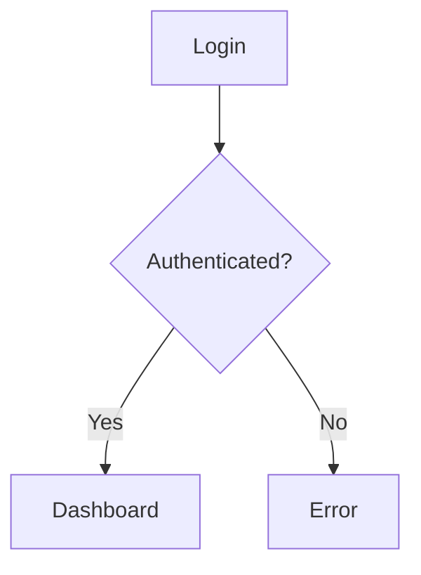

# Wireframe

Low-fidelity wireframe creator for rapid prototyping and UI planning. Three
modes: **ASCII** (text layouts, the default), **wiremd** (interactive
prototypes that render to HTML/React), and **Mermaid** (diagrams for tickets and
PRs).

This is a generative skill — it produces a wireframe, it does not audit code.
Keep output low-fidelity: structure and hierarchy, not colors or fonts.

## Mode selection

Default to **ASCII** unless the request names another mode:

- **wiremd** — "wiremd", "interactive", "renderable", "generate HTML/React".
- **Mermaid** — "mermaid", "diagram", "flowchart", "sequence", "state machine", "user flow".

## Workflow

1. **Clarify scope** — which screen(s), the primary user action, and any states
   to show (empty / loading / error / success).
2. **Reference real components (optional)** — if the project ships a React/TSX
   component library, list it so the wireframe names real components instead of
   inventing them (see below). Skip silently if there's no such directory.
3. **Lay out structure** — header/nav, main content, sidebars, footer; show
   hierarchy with spacing and sizing.
4. **Annotate** — label components, mark interactive elements (buttons, links,
   inputs), note transitions and edge cases.
5. **Stop and let the user review** before expanding to more screens or
   exporting — don't barrel through a whole flow unprompted.

### Reference real components (optional)

If the project has a TSX component directory, a bundled stdlib-only script
lists the components so you can reuse their real names:

```bash
python3 ${CLAUDE_PLUGIN_ROOT}/skills/wireframe/scripts/extract_components.py [components-dir]
```

- The path argument defaults to `src/components`; pass the project's actual
  directory (e.g. `client/src/components`, `app/components`).
- **Fails open**: an absent directory prints "no catalog" and exits 0 — that
  just means wireframe freehand, not an error.
- Resolve the interpreter (`python3`, else `python`); if neither exists, skip
  this step and wireframe without a catalog.
- Pass `--json` for machine-readable output, or `--output catalog.json` to also
  write a JSON file.
- Pass `--update-reference` to inject the catalog into
  `references/reference.md` between its `<!-- WIREFRAME-CATALOG-START/END -->`
  markers (idempotent; re-stamps the timestamp only when the catalog changed).
  Use `--reference <path>` to target a different doc.

## Common layouts

- **Landing page** — header/nav, hero, content sections, footer; hierarchy via spacing.
- **App screens** — one wireframe per screen, arrows for flow between them, document each interaction.
- **Dashboard** — primary metrics first, then panels (main area, sidebar nav, top-bar utilities), chart/table placeholders.
- **User flow** — start state → decision points → success/error paths → end states; one screen per step, annotate triggers and conditional logic.

## ASCII mode (default)

```
+----------------------------------+
|  HEADER [Logo] [Nav] [User]      |
+----------------------------------+
|                                  |
|  Main Content Area               |
|  [Data Table]                    |
|                                  |
+----------------------------------+
|  FOOTER [Links] [Legal]          |
+----------------------------------+
```

See `references/reference.md` for the full ASCII element library (boxes, forms,
navigation, tables, symbols).

## wiremd mode

Use when a clickable prototype or a React-component export is the goal.

```markdown
{.nav}

- [Items](#)
- [Dashboard](#)

# Item List

**Search**: [____]!
**Filter**: [Select ▼]

[Add Item]*

| ID  | Name       | Status | Actions |
| --- | ---------- | ------ | ------- |
| 001 | First Row  | Active | [View]  |
| 002 | Second Row | Paused | [View]  |

[< Previous] [Next >]
```

Rendering (requires the `wiremd` CLI on the user's machine — not bundled):

```bash
wiremd design.md                       # HTML preview
wiremd design.md --style sketch        # Hand-drawn style
wiremd design.md --format react        # React components
wiremd design.md --watch --serve 3000  # Live dev server
```

See `references/reference.md` for the wiremd syntax cheat sheet.

## Mermaid mode

Use for diagrams embedded in GitHub issues/PRs or docs — user flows, state
machines, API sequences.

````

````

- **State diagrams** don't support curly braces `{ }` in labels — use a
  flowchart for complex data structures.
- For better layout in VS Code, add `%%{init: {"flowchart": {"defaultRenderer": "elk"}} }%%` as the first line (GitHub ignores it and auto-renders).
- Renders in: GitHub issues/PRs/markdown, VS Code with the Mermaid extension, and the Mermaid Live Editor (https://mermaid.live).

See `references/reference.md` for the full Mermaid syntax cheat sheet.

## Best practices

- **Keep it low-fidelity** — structure and hierarchy, not colors or fonts.
- **Use real content** over lorem ipsum when you can.
- **Show all states** — empty, loading, error, success per component.
- **Annotate interactions** — hovers, clicks, form submissions, transitions.
- **Document edge cases** — what happens when things go wrong.
- **Indicate content types** — `[Headline]`, `[Body text]`, `[Button label]`.

## Quick reference

| Need               | Example request                          |
| ------------------ | ---------------------------------------- |
| ASCII list page    | "Wireframe the item list page"           |
| wiremd dashboard   | "Create a wiremd for the dashboard"      |
| Mermaid user flow  | "Flowchart for the signup flow"          |
| Mermaid sequence   | "Sequence diagram for the checkout API"  |
| Mermaid state      | "State diagram for the order status"     |
| Component catalog  | Run `extract_components.py` (above)      |
| Syntax cheat sheets| See `references/reference.md`            |
