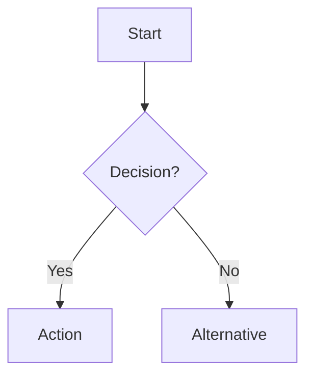
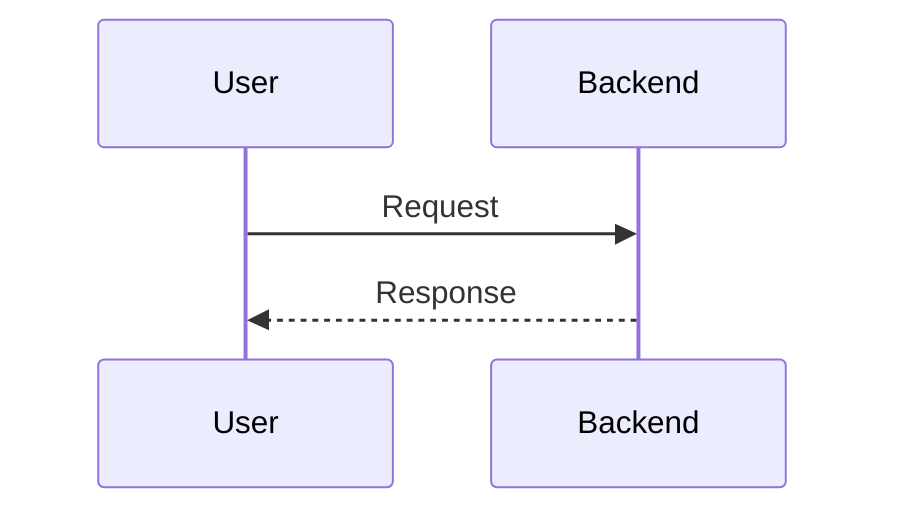
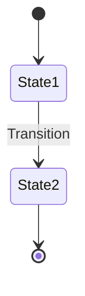
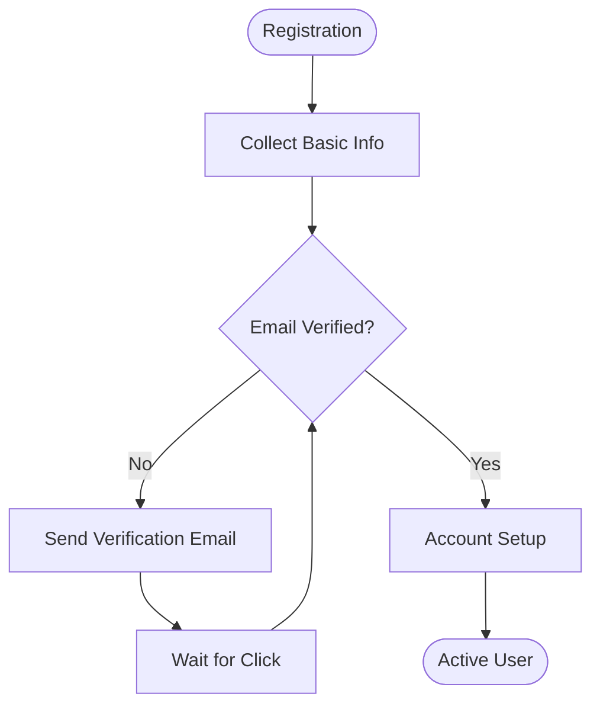

# Wireframe Reference Library

Syntax cheat sheets for the three wireframe modes: ASCII, wiremd, and Mermaid.

---

## Quick reference

| Mode | Syntax | When to use | Full docs |
|------|--------|-------------|-----------|
| **ASCII** | Boxes `+--+`, forms `[____]`, annotations `→ * !` | Page layouts, forms, quick iterations | Cheat sheet below |
| **wiremd** | Markdown + `{.nav}` `{.grid-3}` `[Button]*` | Interactive prototypes, React export | [wiremd docs](https://github.com/wiremd/wiremd) |
| **Mermaid** | Code blocks: `flowchart`, `sequenceDiagram`, `stateDiagram` | Diagrams for GitHub issues/PRs | [Mermaid docs](https://mermaid.js.org/syntax/) |

---

## ASCII cheat sheet

### Symbols

```
[Component Name]  - Placeholder element
[____]            - Text input
[Select ▼]        - Dropdown
( ) (•)           - Radio buttons
[ ] [✓]           - Checkboxes
[Button]*         - Primary button
[Button]          - Secondary button
→                 - User flow direction
*                 - Important/primary action
!                 - Error/warning state
✓                 - Success state
```

### Layout structure

```
+-----+---------------------------+
| Nav | Top Bar [Search] [User]   |
+-----+---------------------------+
|     |                           |
| [L] |     Main Content          |
| [I] |                           |
| [N] |                           |
| [K] |                           |
+-----+---------------------------+
```

### Status indicators

```
[✓] Done - 2025-01-15
[!] Pending
[✗] Failed
```

---

## wiremd cheat sheet

### Core syntax

- **Forms**: `[____]` (input), `[____]!` (required)
- **Buttons**: `[Submit]*` (primary), `[Cancel]` (secondary)
- **Layout**: `{.nav}` (nav), `{.grid-2}` `{.grid-3}` `{.grid-4}` (grids)
- **Images**: `` (placeholder), `` (real)
- **Markdown**: headings, lists, **bold**, *italic*, tables

### CLI

```bash
wiremd file.md                   # Generate HTML
wiremd file.md --format react    # Export React
wiremd file.md --watch --serve   # Live preview
```

The `wiremd` CLI is a third-party tool the user installs separately — it is not
bundled with this plugin. Full reference: https://github.com/wiremd/wiremd

---

## Mermaid cheat sheet

### Flowchart

````

````

**Nodes**: `[Rect]` `(Round)` `{Diamond}` `((Circle))`
**Arrows**: `-->` solid, `-.->` dotted, `==>` thick
**Direction**: `TD` top-down, `LR` left-right

*Optional: add `%%{init: {"flowchart": {"defaultRenderer": "elk"}} }%%` as the first line for better layout in VS Code.*

### Sequence diagram

````

````

**Arrows**: `->>` solid, `-->>` dotted

### State diagram

````

````

**Limitation**: no curly braces `{ }` in labels. Use a flowchart for complex data structures.

Full reference: https://mermaid.js.org/syntax/

---

## Referencing real components

If the project ships a React/TSX component directory, list its components so the
wireframe names real components instead of inventing them:

```bash
python3 ${CLAUDE_PLUGIN_ROOT}/skills/wireframe/scripts/extract_components.py [components-dir]
```

- Defaults to `src/components`; pass the project's actual path.
- Fails open: an absent directory exits 0 with an empty catalog.
- `--json` for machine-readable output; `--output catalog.json` to write a JSON file.
- `--update-reference` injects the catalog into the block below (between the
  CATALOG markers), idempotently re-stamping the timestamp only when it changed.
  Use `--reference <path>` to target a different doc.

### Component catalog

<!-- WIREFRAME-CATALOG-START -->
<!-- WIREFRAME-CATALOG-END -->

---

## Accessibility

Annotate touch targets, contrast, and keyboard navigation when relevant. See
[WCAG 2.1 AA](https://www.w3.org/WAI/WCAG21/quickref/) for requirements (e.g. 44px
touch targets, 4.5:1 contrast, full keyboard nav).

---

## Examples

### ASCII: list page

```
+-----+---------------------------------------------------+
| [=] | App                       [Search] [@][🔔][Profile]|
+-----+---------------------------------------------------+
|     | Item List                                 [+ Add] |
| [H] |                                                   |
| [I] | [Filter: All ▼] [Status: Active ▼]  [Search___]  |
| [N] |                                                   |
| [K] | +-----+--------+----------+--------+----------+  |
|     | | ID  | Name   | Group    | Status | Actions  |  |
|     | +-----+--------+----------+--------+----------+  |
|     | | 001 | Item A | North    | Active | [View]   |  |
|     | | 002 | Item B | South    | Paused | [View]   |  |
|     | +-----+--------+----------+--------+----------+  |
|     |                                                   |
|     | [< Previous] Page 1 of 5 [Next >]                |
+-----+---------------------------------------------------+
```

### wiremd: dashboard

```markdown
{.nav}
- [Dashboard](#)
- [Items](#)
- [Reports](#)

# Dashboard

**Filter**: [All ▼]

{.grid-4}

### Active Items
**156**
+12 this month

### Pending
**23**
↓ 5 from last week

### Completed
**8**
2 in progress

### Success Rate
**87%**
+3% vs goal

---

## Recent Activity

| Item    | Group    | Step     | Status   |
|---------|----------|----------|----------|
| Item A  | Group-01 | Baseline | Complete |
| Item B  | Group-02 | Week 4   | Pending  |
```

### Mermaid: signup flow

````

````

*Tip: add the ELK init block for better layout in VS Code.*
