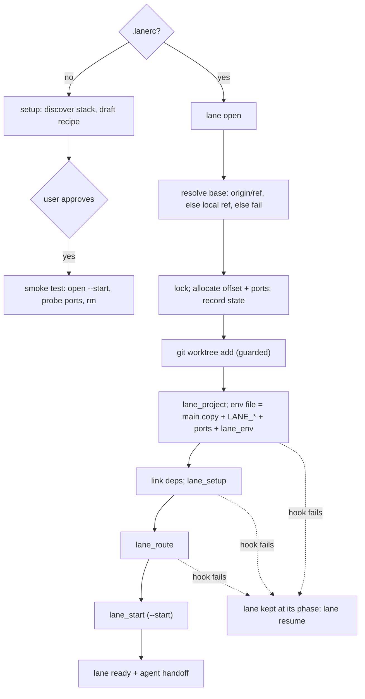

# Worktree Lanes

Run several branches of a repo at once, each in its own git worktree with its own env
file, ports, and (when the recipe supports it) database and hostnames — so parallel
work never collides. One stack-agnostic engine; the per-repo part is a `.lanerc` recipe
the agent discovers and drafts, and you approve.

## Install

```
/plugin install worktree-lanes@nautilai
```

## Usage

```
/worktree-lanes --setup                     # discover this repo's stack, draft a .lanerc
/worktree-lanes feat-x                      # open a lane (host mode)
/worktree-lanes feat-x --isolated --start   # own DB/stack, start services
/worktree-lanes feat-x --base release/2.4   # cut from another ref
```

The engine directly:

```
lane open <slug> [--proxy|--isolated] [--start] [--base <ref>]
lane pr <number> [--proxy|--isolated] [--start]     # lane pr-<number> on the PR branch
lane resume <slug> [--start] [--env]                # finish a failed open / restart / regen env
lane rm <slug> [--force]                            # refuses uncommitted work; keeps the branch
lane ls | lane gc
```

## How it works



- **Engine** (`scripts/lane`): worktree, base resolution, port allocation, env file,
  linking, lifecycle, engine state under `<LANE_ROOT>/.state/`.
- **Recipe** (`.lanerc`): sourced bash supplying hooks (`lane_env`, `lane_setup`,
  `lane_route`, `lane_start`, `lane_stop`, …) and vars. Contract:
  [`skills/worktree-lanes/references/contract.md`](skills/worktree-lanes/references/contract.md).
  Example: [`references/lanerc.example`](skills/worktree-lanes/references/lanerc.example).

## Modes

| Mode | Flag | Database | Hostnames |
|---|---|---|---|
| host | *(default)* | shared with main | none |
| proxy | `--proxy` | shared with main | per lane, via the recipe's `lane_route` |
| isolated | `--isolated` | per lane, provisioned by the recipe | per lane |

A mode is available only if the recipe lists it in `LANE_MODES`; the engine provisions
nothing per mode itself.

## Guarantees

- **No silent base.** `origin/<base>` after a fetch, else a local `<base>` (warned),
  else the open fails. The resolved ref and SHA are printed.
- **Ports don't collide among lanes.** Offsets start at 1 (main is 0). Under a repo
  lock, allocation skips offsets whose ports clash with main, another lane's
  reservation (including in-progress opens), ports recorded in lanes made by other
  tooling, or a listening socket. `lane_env` may not override an allocated port.
- **One definition per engine-set key.** Each key the engine or `lane_env` sets
  replaces every earlier definition (`KEY=`, `export KEY=`, CRLF) from main's copy.
  Other keys from main's copy are passed through as written. The env file must stay
  untracked and inside the lane; that is re-checked before every write.
- **Strict hooks.** Each hook runs in its own bash process with `set -euo pipefail`, so
  however the engine calls it, a hook that fails stops the verb and keeps the lane at
  its phase for `lane resume`. (Bash's usual limits apply inside a hook: check failures
  in `$(…)` explicitly.) An open that dies before the worktree exists leaves a
  reservation that `lane gc` (or reopening the slug) reclaims once its process is gone.
- **Work is never discarded implicitly.** `rm` refuses any uncommitted change except
  the engine's own artifacts (the untracked env file, link-dir symlinks), and refuses a
  failing teardown hook — unless `--force`. It keeps the branch.
- **Checkout hooks off at creation.** The repo's `post-checkout` hook doesn't run while
  the engine creates a lane, so it can't run a second, conflicting setup; `lane_setup`
  is the bootstrap. `LANE_CHECKOUT_HOOKS=1` turns them on.
- **Self-ignored.** The lanes root writes its own `.gitignore`.

## Design notes

- **The recipe is code.** It runs with your privileges on every verb; review it, and
  re-review edits. The skill treats writing or changing it as a user stop.
- **Install per lane by default.** Symlinking deps from main is opt-in for dirs proven
  identical across branches.
- **Isolate only what collides.** Ports, DB, hostnames, Compose project names.
- **Worktrees are not relocatable.** Rebuild a lane rather than moving it.
- **Secrets.** By default a lane's env file copies main's (`LANE_ENV_COPY=0` to opt
  out); `rm` deletes it with the worktree.
- **On/off settings are `1`/`0`.** Every switch is named for what it turns on, so `1`
  always means "do it"; other values are rejected rather than guessed.

## Requirements

bash 3.2+, git 2.20+; `gh` for `lane pr`; `lsof` for listening-port checks (skipped
when absent). macOS and Linux; Windows only under WSL.

## Tests

```bash
bash worktree-lanes/tests/lane.test.sh                         # default bash
LANE_TEST_BASH=/bin/bash bash worktree-lanes/tests/lane.test.sh  # e.g. macOS bash 3.2
```

Offline lifecycle suite on throwaway repos, with socket discovery stubbed: argument
parsing, base resolution, rm safety, strict hooks + resume, env key replacement and
destination checks, port allocation (incl. other tooling's lanes), reservations, stale
locks, concurrent opens, gc, self-ignore. CI runs it on Linux bash 5 and macOS bash 3.2.

## Validated scope

The suite covers the engine. Recipes are per-repo: a stack's `lane_setup`/`lane_start`
are only as good as the recipe, which is why setup ends with a started, probed, and
removed smoke-test lane. The native installed-plugin path (skill triggering from a real
`/plugin install`) has not been dogfooded yet.
